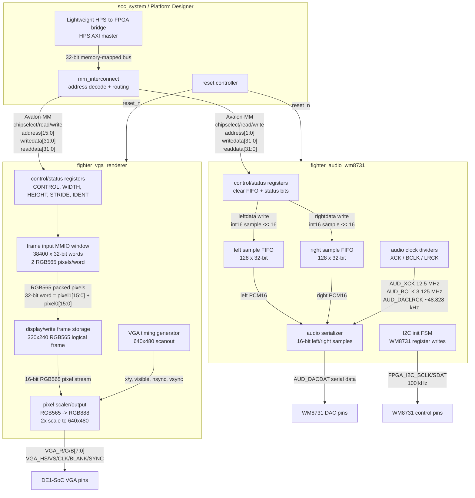

# Hardware Block Interconnect Diagram

下面这两张图按真实项目结构画：HPS 负责游戏逻辑、输入解析、资源读取和像素/音频样本生成；FPGA 负责 VGA 硬件扫描输出和 WM8731 音频串行输出。

## 系统级连接图

```mermaid
flowchart LR
  subgraph USB["USB 外设"]
    KB1["Keyboard 1\nUSB HID boot keyboard\n8-byte report"]
    KB2["Keyboard 2\nUSB HID boot keyboard\n8-byte report"]
  end

  subgraph HPS["HPS / Linux / User Space"]
    LIBUSB["libusb polling\nusb_hid_keyboard.c\n2 keyboards, ~960 B/s @ 60 FPS"]
    INPUT["fighter_input.c\nkey report -> player command"]
    GAME["fighter_game.c\n60 FPS state machine\nposition / HP / attack / events"]
    ASSETS["game_assets/\nPPM sprites/background/menu\nWAV PCM audio"]
    RENDER["fighter_renderer.c\nsoftware composition\n320x240 RGB565 frame"]
    AUDIO_SW["fighter_audio.c\nWAV loader + mixer/resampler\nstereo PCM16"]
    DEV_MEM["/dev/mem mmap\nphysical MMIO access"]
  end

  subgraph BRIDGE["Lightweight HPS-to-FPGA Bridge"]
    AXI["AXI master from HPS\n32-bit data path\nmemory-mapped transactions"]
    AVALON["Platform Designer interconnect\nAXI/Avalon-MM decode\n32-bit data"]
  end

  subgraph FPGA["FPGA Custom Hardware"]
    VGA_IP["fighter_vga_renderer\nAvalon-MM slave\nbase 0xFF240000\n32-bit data, 16-bit word address"]
    AUDIO_IP["fighter_audio_wm8731\nAvalon-MM slave\nbase 0xFF200000\n32-bit data, 2-bit word address"]
  end

  subgraph BOARD["Board Peripherals"]
    VGA["VGA connector / DAC\n640x480 @ ~60 Hz\nRGB[7:0] x3 + HS/VS/CLK/BLANK/SYNC"]
    CODEC["WM8731 audio codec\nleft-justified serial DAC\n16-bit stereo"]
    I2C["WM8731 control port\nI2C @ 100 kHz\n7-bit addr 0x1A"]
    LED["LEDR[0:1]\ncodec init status"]
  end

  KB1 -->|"USB HID interrupt IN\n8 bytes/report"| LIBUSB
  KB2 -->|"USB HID interrupt IN\n8 bytes/report"| LIBUSB
  LIBUSB -->|"keyboard report structs"| INPUT
  INPUT -->|"fighter_player_result_t\ncommands/buttons"| GAME
  ASSETS -->|"PPM image files\nloaded by CPU from filesystem"| RENDER
  ASSETS -->|"WAV PCM files\nloaded by CPU from filesystem"| AUDIO_SW
  GAME -->|"game state structs\npositions, HP, states"| RENDER
  GAME -->|"audio events\nmenu/confirm/game-over"| AUDIO_SW
  RENDER -->|"RGB565 frame writes\n320x240x16b = 153.6 KB/frame\n9.216 MB/s @ 60 FPS"| DEV_MEM
  AUDIO_SW -->|"PCM16 stereo FIFO writes\n~192 KB/s @ 48 kHz\n1.536 Mbit/s payload"| DEV_MEM
  DEV_MEM -->|"physical writes"| AXI
  AXI -->|"lightweight bridge"| AVALON
  AVALON -->|"Avalon-MM writes\n32-bit data\nframe window words 1024..39423"| VGA_IP
  AVALON -->|"Avalon-MM writes\n32-bit data\nregs 0..3"| AUDIO_IP
  VGA_IP -->|"parallel VGA\nRGB 24-bit + sync\n~25 MHz pixel clock\n~600 Mbit/s RGB lane rate"| VGA
  AUDIO_IP -->|"AUD_DACDAT + BCLK/LRCK/XCK\nBCLK 3.125 MHz\nLRCK ~48.828 kHz"| CODEC
  AUDIO_IP -->|"FPGA_I2C_SCLK/SDAT\n100 kHz I2C init sequence"| I2C
  AUDIO_IP -->|"init_done/init_error\n1 bit each"| LED
```

## FPGA 内部硬件 Block 图

## 适合 image2.0 的文字提示

Draw a clean engineering hardware block diagram for a DE1-SoC fighting game. Use four vertical columns from left to right: USB peripherals, HPS/Linux software, lightweight HPS-to-FPGA bridge, FPGA custom hardware, and board peripherals. Show two USB HID keyboards feeding libusb polling on the HPS. HPS software blocks are `fighter_input.c`, `fighter_game.c`, `fighter_renderer.c`, `fighter_audio.c`, and `game_assets`. The renderer writes a 320x240 RGB565 frame through `/dev/mem` to the FPGA VGA IP at physical address `0xFF240000`, using 32-bit Avalon-MM writes, 38400 words per frame, 153.6 KB/frame, 9.216 MB/s at 60 FPS. The audio software writes stereo PCM16 samples through `/dev/mem` to the FPGA audio IP at physical address `0xFF200000`, using 32-bit Avalon-MM FIFO registers, about 192 KB/s at 48 kHz stereo. The bridge is a lightweight HPS-to-FPGA AXI master connected to a Platform Designer Avalon-MM interconnect. FPGA hardware contains `fighter_vga_renderer` and `fighter_audio_wm8731`. The VGA IP outputs 640x480 VGA with 24-bit RGB plus HS, VS, CLK, BLANK, and SYNC, about 25 MHz pixel clock and about 600 Mbit/s RGB lane rate. The audio IP outputs WM8731 left-justified serial audio with XCK 12.5 MHz, BCLK 3.125 MHz, LRCK about 48.828 kHz, and configures the codec over 100 kHz I2C at address 0x1A. Also show LEDR[0] and LEDR[1] carrying codec init done/error status. Label every arrow with protocol, signal width, and bandwidth.
